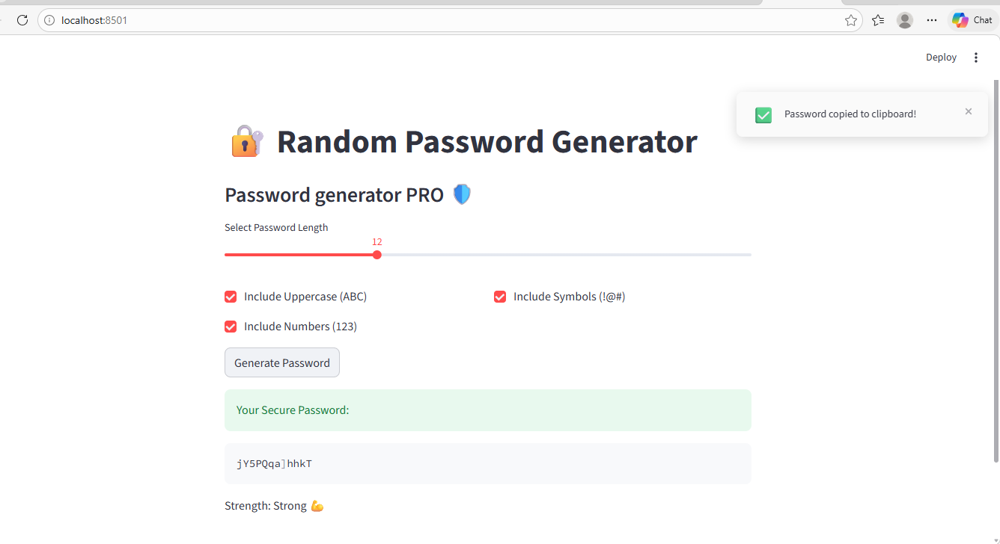

 

:

🔐 SecurePass: Random Password Generator
 An interactive web application built with Python and Streamlit that allows users to generate highly secure, randomized passwords with customizable complexity. Which has the additional features like  copy and a popup displaying the copy to clipboard.

🚀 Features:

 *Customizable Complexity: Toggle between Uppercase, Numbers, and Special Symbols to meet specific security needs.

 *Dynamic Length Control: Uses an interactive slider to set password length from 4 to 32 characters.

 *Strength Validation: Instantly categorizes passwords as Weak, Medium, or Strong based on length.

 *Interactive Feedback: Uses st.toast, st.balloons, and st.snow to provide a fun and responsive user experience.

 *One-Click Generation: Simple button interface for instant results.

🛠️ Tech Stack
Language: Python 3.x

Framework: Streamlit

Libraries: random, string, time

📦 How to Run Locally
Install requirements:

pip install streamlit

Clone the Repository:

git clone https://github.com/Sinchana/password-generator.git

To Run:

streamlit run app.py
Note: If "command not found" appears, use python -m streamlit run app.py.

📂 Project Structure
Plaintext
password-generator/
├── app.py
├── requirements.txt
├── README.md
└── screenshot.png

💡 Example Usage
-Once the app is running in your browser, follow these steps:

  #Set Length: Move the slider to your desired character count (e.g., 16).

  #Select Options: Check the boxes for Numbers or Symbols to increase security.

  #Generate: Click the "Generate Password" button.

  #Check Result: The app will display your secure password and a color-coded strength category:

❄️ Weak (< 8 characters)

🛡️ Medium (8 - 12 characters)

🎈 Strong (> 12 characters)

🎓 Learning Outcomes:

Web App Development: Built a functional UI using the Streamlit framework.

Security Logic: Implemented randomized character selection for high-entropy passwords.

UI/UX Design: Applied "Visibility of System Status" using loading spinners and toasts.

State Management: Managed application behavior using Streamlit controls.

Version Control: Managed the full Git/GitHub workflow for project hosting.

Author
Sinchana Bhandary
BCA Student and Aspiring UI/UX Designer.
[LinkedIn](https://www.linkedin.com/in/sinchana-bhandary-06942b380)
